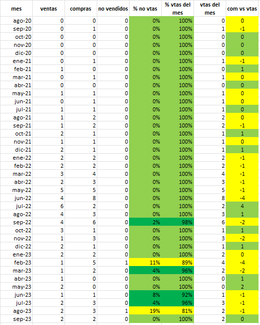
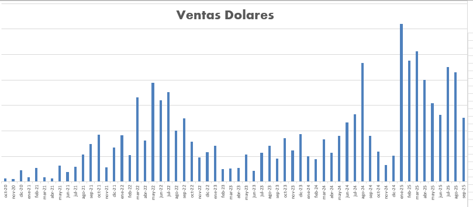

# Seguimiento de Negocio Myfigure4ever

Modelo en Excel + análisis de datos para gestionar un microemprendimiento de venta de figuras coleccionables importadas de Japón, con foco en costos, márgenes, stock, flujo de caja y rentabilidad.

---

> ⚠️ **Confidencialidad**: Los datos del repositorio público están **anonimizados** (o reemplazados por valores ficticios/escala). El contenido tiene fines demostrativos para mi CV/portfolio.

---

🎯 Objetivo

Consolidar compras, ventas y envíos en un único archivo.

Calcular costo completo unitario (producto + shipping + impuestos + comisiones).

Medir margen bruto y neto por SKU, lote y canal (MercadoLibre, Instagram).

Proyectar flujo de caja y punto de reorden de stock.

Detectar mercadería lenta (rotación/aging) y oportunidades de repricing.

---

🛠️ Desarrollo

Archivo Excel con hojas de Compras, Ventas, Stock, Gastos, Parámetros y Reportes.

Tablas dinámicas y fórmulas para consolidar márgenes y rentabilidad.

Seguimiento de inventario (ubicación: Japón, Miami, Argentina) y aging de stock.

Control de flujo de caja con proyección de pagos y cobros.

Reportes visuales para monitorear KPIs clave.

---

📸 Ejemplo del dashboard de control de stock y márgenes:

---

📸 Ejemplo de análisis de rotación y mercadería lenta:

---

📸 Ejemplo de historico ventas:

---

📊 Resultados

Visibilidad clara de ingresos, costos y márgenes netos.

Procesamiento y análisis de volúmenes de datos históricos (>5 años).

Identificación de productos con baja rotación para toma de decisiones comerciales.

Base sólida para proyecciones de demanda y análisis de pricing.

---

📊 KPIs Clave
- Ingresos, COGS y Margen (bruto / neto) por SKU, lote y canal
- ROI por ítem y payback de cada lote
- Rotación e inventario envejecido (30/60/90/120+ días)
- Aged stock value y alertas de slow movers
- Tasa de conversión y ticket promedio por canal
- Cash conversion cycle (caja invertida → caja cobrada)

---

🔧 Tecnologías utilizadas

Excel avanzado (tablas dinámicas, fórmulas, proyecciones).

Análisis de datos aplicado a costos, márgenes y ventas.

Marketing digital y seguimiento de ventas multicanal (ML, IG).
